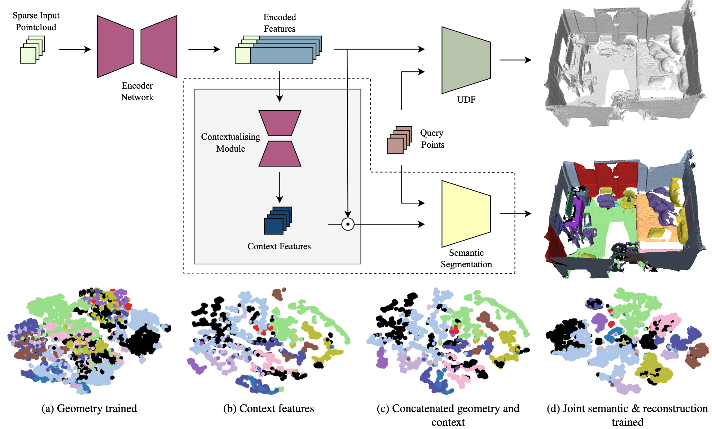

This is the landing page for paper **Contextualising Implicit Representations for Semantic Tasks**.

## Abstract
Prior works have demonstrated that implicit representations trained only for reconstruction tasks typically generate encodings that are not useful for semantic tasks.
In this work, we propose a method that contextualises the encodings of implicit representations, enabling their use in downstream tasks (e.g. semantic segmentation), without requiring access to the original training data or encoding network.
Using an implicit representation trained for a reconstruction task alone, our contextualising module takes an encoding trained for reconstruction only and reveals meaningful semantic information that is hidden in the encodings, without compromising the reconstruction performance.
With our proposed module, it becomes possible to pre-train implicit representations on larger datasets, improving their reconstruction performance compared to training on only a smaller labelled dataset, whilst maintaining their segmentation performance on the labelled dataset.
Importantly, our method allows for future foundation implicit representation models to be fine-tuned on unseen tasks, without retraining the encoder.


## Code

The code for reproducing results in the paper can be obtained from the [GitHub repository](https://github.com/ActiveVisionLab/IRContext).

## Citation

BiBTeX:

```
@InProceedings{costain2024contextualising,
    title={Contextualising Implicit Representations for Semantic Tasks},
    author={Theo W. Costain and Victor A. Prisacariu},
    booktitle = {CVPRW},
    month = {June},
    year = {2024}
}
```